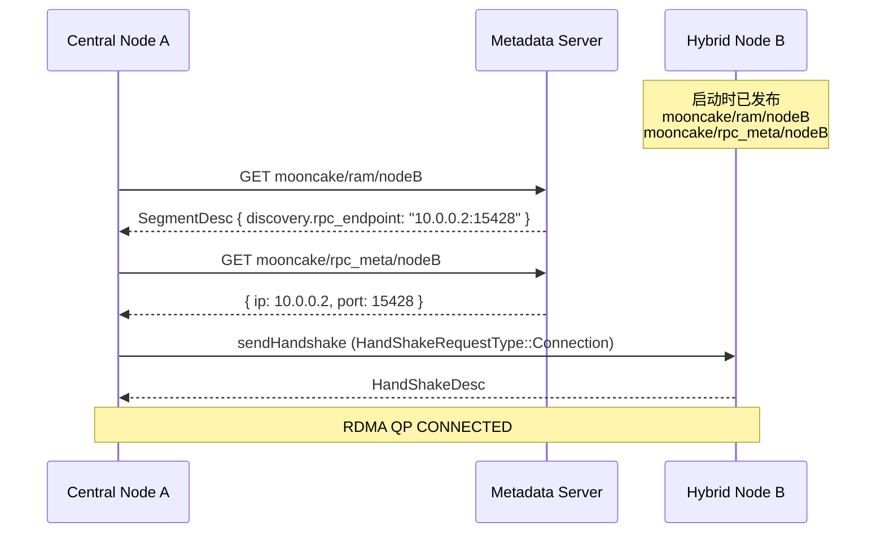
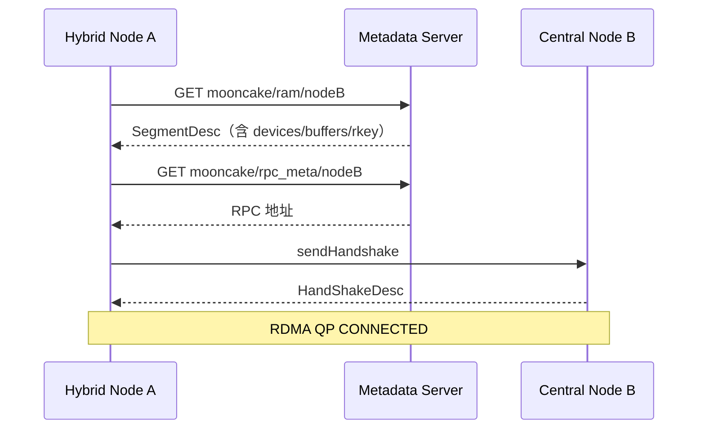
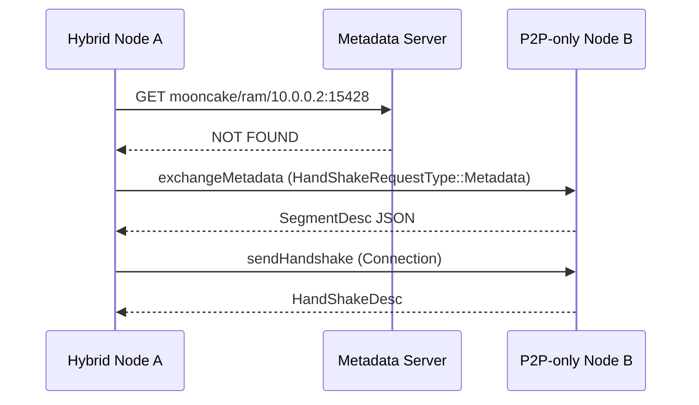

# Metadata Server 与 P2PHandshake 混合发现模式设计

## 文档信息

| 项目 | 内容 |
|------|------|
| 状态 | Draft — 待 Review |
| 作者 | Mooncake Team |
| 创建日期 | 2026-06-12 |
| 关联模块 | `mooncake-transfer-engine`（Legacy + TENT）、`mooncake-store`、`mooncake-wheel` |

## 1. 背景与动机

### 1.1 问题陈述

Mooncake Transfer Engine 在建立 RDMA 连接时分为两层：

1. **元数据发现层（Layer 1）**：获取对端 `SegmentDesc`（设备、buffer、rkey）和 RPC 握手地址。
2. **RDMA QP 握手层（Layer 2）**：通过 TCP 交换 `HandShakeDesc`，调用 `ibv_modify_qp` 完成建连。

Layer 2 在两种模式下完全相同；不兼容的是 Layer 1。当前实现通过全局布尔 `p2p_handshake_mode_` 在构造时二选一：

- **Central 模式**（`etcd://`、`http://`、`redis://`）：通过 metadata server 读写 segment 与 rpc_meta。
- **P2P 模式**（`P2PHANDSHAKE`）：不创建 `storage_plugin_`，segment 不发布，通过 `exchangeMetadata()` TCP 直连获取对端描述符。

这导致同一集群中无法混合部署两种模式的节点：Central 节点无法按 hostname 发现 P2P 节点，P2P 节点也无法按 central 注册的 segment name 访问 Central 节点。

### 1.2 目标

实现 **Hybrid Metadata Discovery（混合元数据发现）**，使以下场景均可工作：

| 场景 | Initiator | Target | 当前 | 目标 |
|------|-----------|--------|------|------|
| A | Central | Central | ✅ | 保持 |
| B | P2P | P2P | ✅ | 保持 |
| C | Central | P2P | ❌ | ✅ |
| D | P2P | Central | ❌ | ✅ |
| E | Hybrid | Hybrid | ❌ | ✅ |

### 1.3 非目标（首版）

- 无 metadata server 的纯 P2P 集群自动 hostname 发现（仍需 `ip:port` 或 central 注册）。
- 跨传输协议互通（如 RDMA segment 与 TCP segment 互访）。
- 修改 Layer 2 握手协议格式（`HandShakeRequestType`、`HandShakeDesc` 保持不变）。
- 统一 Legacy 与 TENT 为单一代码库（两者分别实现，但行为对齐）。

---

## 2. 现状分析

### 2.1 架构分层

```
┌─────────────────────────────────────────────────────────────┐
│                    Application Layer                         │
│         openSegment(name) → submitTransfer → poll           │
└──────────────────────────┬──────────────────────────────────┘
                           │
┌──────────────────────────▼──────────────────────────────────┐
│              Layer 1: Metadata Discovery                     │
│  ┌─────────────────────┐    ┌─────────────────────────────┐ │
│  │ Central (etcd/http) │    │ P2P (P2PHANDSHAKE)          │ │
│  │ storage.get/set     │    │ exchangeMetadata() TCP RPC  │ │
│  │ rpc_meta lookup     │    │ parseHostNameWithPort()     │ │
│  └─────────────────────┘    └─────────────────────────────┘ │
│              ▲ 互斥（p2p_handshake_mode_） ▲                  │
└──────────────────────────┬──────────────────────────────────┘
                           │
┌──────────────────────────▼──────────────────────────────────┐
│              Layer 2: RDMA QP Handshake（共享）                │
│  sendHandshake() → setupConnectionsByActive/Passive          │
│  ibv_modify_qp: RESET → INIT → RTR → RTS                     │
└─────────────────────────────────────────────────────────────┘
```

### 2.2 关键代码路径（Legacy Engine）

| 操作 | Central 模式 | P2P 模式 |
|------|-------------|----------|
| 构造 | 创建 `storage_plugin_` | `p2p_handshake_mode_=true`，提前 return |
| `updateSegmentDesc()` | 写入 `mooncake/ram/[name]` | no-op |
| `addRpcMetaEntry()` | 写入 `mooncake/rpc_meta/[name]` | 仅启动 TCP daemon |
| `getSegmentDesc()` | `storage_plugin_->get()` | `exchangeMetadata(ip, port)` |
| `getRpcMetaEntry()` | `storage_plugin_->get(rpc_meta/...)` | `parseHostNameWithPort()` |
| `openSegment(name)` | name = hostname | name = `ip:port` |

相关源码：

- `mooncake-transfer-engine/include/transfer_metadata.h` — `P2PHANDSHAKE`、`p2p_handshake_mode_`
- `mooncake-transfer-engine/src/transfer_metadata.cpp` — 上述分支逻辑
- `mooncake-transfer-engine/src/transfer_engine_impl.cpp` — P2P 动态 RPC 端口绑定
- `mooncake-transfer-engine/src/transfer_metadata_plugin.cpp` — `SocketHandShakePlugin::exchangeMetadata()`

### 2.3 关键代码路径（TENT Engine）

TENT 通过 `SegmentRegistry` 抽象实现相同分裂：

| 类 | 行为 |
|----|------|
| `CentralSegmentRegistry` | `MetaStore::get/set`，key 前缀 `mooncake/tent/` |
| `PeerSegmentRegistry` | `ControlClient::getSegmentDesc()` RPC；`putSegmentDesc()` 为 no-op |

选择逻辑在 `ControlService` 构造函数中，由 `metadata_type` 配置决定（`p2p` vs `etcd`/`http` 等）。

TENT `SegmentDesc` 已包含 `rpc_server_addr` 字段（用于 RPC 寻址），在 `transfer_engine_impl.cpp` 初始化时写入。Central 模式下该字段随 segment 发布到 MetaStore，可作为混合模式的基础。

### 2.4 现有不兼容根因

| # | 根因 | 影响 |
|---|------|------|
| 1 | `p2p_handshake_mode_` 全局互斥 | 节点只能处于一种发现模式 |
| 2 | P2P 节点不发布 segment/rpc_meta | Central 节点无法发现 P2P 节点 |
| 3 | Segment 命名约定不同 | hostname vs `ip:port` |
| 4 | P2P 动态 RPC 端口 | Central 中 rpc_meta 可能在重启后过期 |
| 5 | `receivePeerMetadata` 未缓存对端 metadata | P2P 被动方无法复用对端信息 |
| 6 | Legacy 与 TENT 双实现 | 需分别改造并对齐行为 |

---

## 3. 设计方案

### 3.1 设计原则

1. **向后兼容**：`central` 和 `p2p` 纯模式行为不变；新能力通过 `hybrid` 模式 opt-in。
2. **发布与查询解耦**：Hybrid 节点同时支持 Central 发布和 P2P 直连查询。
3. **Fallback 而非替换**：查询时 Central 优先，失败时降级到 P2P。
4. **最小协议变更**：`HandShakeRequestType` 和 QP 握手流程不变；仅扩展 segment JSON schema。
5. **双引擎对齐**：Legacy 与 TENT 共享同一语义，字段名允许有引擎差异但含义一致。

### 3.2 发现模式枚举

引入 `MetadataDiscoveryMode` 替代布尔 `p2p_handshake_mode_`：

```cpp
enum class MetadataDiscoveryMode {
    Central,   // 仅 Central store（现有 etcd/http/redis 行为）
    P2P,       // 仅 P2P exchange（现有 P2PHANDSHAKE 行为）
    Hybrid,    // Central 为主 + P2P fallback；双向发布
};
```

配置来源（优先级从高到低）：

| 优先级 | 配置方式 | 示例 |
|--------|----------|------|
| 1 | 环境变量 | `MC_METADATA_DISCOVERY_MODE=hybrid` |
| 2 | 连接串后缀 | `etcd://10.0.0.1:2379+P2PHANDSHAKE` |
| 3 | TENT JSON | `"metadata_type": "hybrid"` |
| 4 | 隐式推导 | `metadata_server=P2PHANDSHAKE` → P2P；否则 → Central |

连接串解析规则：

```
输入: "etcd://host:2379+P2PHANDSHAKE"
  → storage_conn = "etcd://host:2379"
  → discovery_mode = Hybrid

输入: "P2PHANDSHAKE"
  → storage_conn = nullptr
  → discovery_mode = P2P

输入: "etcd://host:2379" + MC_METADATA_DISCOVERY_MODE=hybrid
  → storage_conn = "etcd://host:2379"
  → discovery_mode = Hybrid
```

### 3.3 SegmentDesc Schema 扩展

#### 3.3.1 Legacy Engine

在现有 `SegmentDesc` JSON 中增加可选 `discovery` 对象：

```json
{
  "name": "nodeB",
  "protocol": "rdma",
  "rdma_server_name": "10.0.0.2",
  "discovery": {
    "mode": "hybrid",
    "rpc_endpoint": "10.0.0.2:15428",
    "prefer": "central"
  },
  "devices": [ ... ],
  "buffers": [ ... ],
  "priority_matrix": { ... }
}
```

| 字段 | 类型 | 必填 | 说明 |
|------|------|------|------|
| `discovery.mode` | string | 否 | `"central"` / `"p2p"` / `"hybrid"`；缺省视为 `"central"` |
| `discovery.rpc_endpoint` | string | Hybrid/P2P 推荐 | QP 握手用 TCP 地址，格式 `host:port` |
| `discovery.prefer` | string | 否 | 查询偏好：`"central"`（默认）或 `"p2p"` |

**向后兼容**：旧客户端/旧 segment JSON 无 `discovery` 字段时，行为与现有一致。

#### 3.3.2 TENT Engine

TENT 已有 `rpc_server_addr`，扩展方式：

```json
{
  "name": "nodeB",
  "type": "memory",
  "rpc_server_addr": "10.0.0.2:15428",
  "rdma_server_name": "10.0.0.2",
  "discovery": {
    "mode": "hybrid",
    "prefer": "central"
  }
}
```

规则：`discovery.rpc_endpoint` 若存在则覆盖 `rpc_server_addr`；否则沿用 `rpc_server_addr`。

### 3.4 MetadataResolver 抽象

将 `TransferMetadata` 中的 `if (p2p_handshake_mode_)` 分支抽取为策略类：

```
                    ┌─────────────────────┐
                    │  MetadataResolver   │
                    │  (interface)        │
                    └─────────┬───────────┘
                              │
          ┌───────────────────┼───────────────────┐
          │                   │                   │
┌─────────▼────────┐ ┌────────▼────────┐ ┌───────▼────────┐
│ CentralResolver  │ │  P2pResolver    │ │ HybridResolver │
│ storage get/set  │ │ exchangeMetadata│ │ compose +      │
│ rpc_meta lookup  │ │ parse ip:port   │ │ fallback chain │
└──────────────────┘ └─────────────────┘ └────────────────┘
```

#### 3.4.1 `getSegmentDesc(segment_name)` — Hybrid Fallback 链

```
1. 本地 cache（segment_id_to_desc_map_，受 metacache / force_update 控制）
2. Central store: GET mooncake/ram/[segment_name]
   └─ 成功 → decode → 若 discovery.rpc_endpoint 存在则缓存到 rpc_meta_map_
3. 若 segment_name 符合 ip:port 格式 → P2P exchangeMetadata(segment_name)
4. 若步骤 2 成功但 buffer 可能过期（force_update=true）→ 用 discovery.rpc_endpoint 做 P2P refresh
5. 全部失败 → 返回 nullptr，记录明确错误原因
```

**ip:port 格式判定**（`isDirectConnectEndpoint(name)`）：

- 必须包含且仅包含一个 `:`（IPv6 使用 `[addr]:port` 形式）。
- port 为 1–65535 整数。
- 不满足则视为 logical hostname，仅走 Central 路径。

#### 3.4.2 `getRpcMetaEntry(server_name)` — Hybrid Fallback 链

```
1. 本地 rpc_meta_map_ cache
2. Central store: GET mooncake/rpc_meta/[server_name]
3. 从已缓存 SegmentDesc 的 discovery.rpc_endpoint / rpc_server_addr 解析
4. parseHostNameWithPort(server_name)（server_name 本身为 ip:port）
5. 全部失败 → ERR_METADATA
```

#### 3.4.3 发布路径（Hybrid 模式）

| 操作 | Hybrid 行为 |
|------|-------------|
| `updateSegmentDesc()` | 写入 Central store；`discovery` 字段包含当前 `rpc_endpoint` |
| `addRpcMetaEntry()` | 写入 Central `rpc_meta/[name]`；注册 P2P metadata callback |
| `removeSegmentDesc()` | 删除 Central 条目 + 清理本地 cache |
| `rePublishRpcMetaEntry()` | 端口变化时更新 Central（P2P 动态端口场景） |
| P2P daemon | 始终启动；响应 `HandShakeRequestType::Metadata` |

### 3.5 节点生命周期

#### 3.5.1 Hybrid 节点启动

```
TransferEngine::init(metadata_server="etcd://...", discovery_mode=Hybrid)
  │
  ├─ 创建 storage_plugin_（etcd/http/redis）
  ├─ 创建 handshake_plugin_（SocketHandShakePlugin）
  ├─ 分配动态 RPC 端口（与现 P2P 逻辑相同）
  ├─ local_server_name_ = hostname（segment 逻辑名，非 ip:port）
  ├─ discovery.rpc_endpoint = bind_ip:rpc_port
  ├─ addRpcMetaEntry(hostname, {bind_ip, rpc_port})  → 写 Central
  ├─ updateLocalSegmentDesc()                         → 写 Central（含 discovery）
  └─ startHandshakeDaemon()                           → 监听 Metadata + Connection RPC
```

与纯 P2P 的区别：Hybrid 保留 hostname 作为 segment name，同时把 `rpc_endpoint` 写入 Central。

与纯 Central 的区别：Hybrid 额外启动 P2P metadata exchange，并写入 `discovery` 字段。

#### 3.5.2 P2P 节点迁移到 Hybrid

```
# 迁移前（纯 P2P）
metadata_server=P2PHANDSHAKE
local_server_name=10.0.0.2:15428   # segment name = ip:port

# 迁移后（Hybrid）
metadata_server=etcd://10.0.0.1:2379+P2PHANDSHAKE
# 或
metadata_server=etcd://10.0.0.1:2379
MC_METADATA_DISCOVERY_MODE=hybrid
local_server_name=nodeB           # 恢复 hostname 语义
```

迁移时 segment name 从 `ip:port` 变为 hostname，需确保集群内其他节点更新 `openSegment` 参数。

### 3.6 典型交互时序

#### 场景 C：Central Initiator → P2P/Hybrid Target



#### 场景 D：P2P/Hybrid Initiator → Central Target



#### 场景：Central 查不到，Fallback 到 P2P



### 3.7 TENT 引擎对齐

#### 3.7.1 HybridSegmentRegistry

```cpp
class HybridSegmentRegistry : public SegmentRegistry {
    std::unique_ptr<CentralSegmentRegistry> central_;
    // P2P path reuses ControlClient::getSegmentDesc()

    Status getSegmentDesc(SegmentDescRef& desc, const std::string& name) override;
    Status putSegmentDesc(SegmentDescRef& desc) override;  // 写 Central + 填 discovery
    Status deleteSegmentDesc(const std::string& name) override;
};
```

`ControlService` 构造分支：

```cpp
if (type == "p2p")       → PeerSegmentRegistry
else if (type == "hybrid") → HybridSegmentRegistry
else                     → CentralSegmentRegistry
```

#### 3.7.2 TENT 与 Legacy 字段映射

| 语义 | Legacy | TENT |
|------|--------|------|
| Segment 逻辑名 | `SegmentDesc::name` | `SegmentDesc::name` |
| RPC 握手地址 | `discovery.rpc_endpoint` | `rpc_server_addr`（可被 discovery 覆盖） |
| RDMA NIC path 服务器名 | `rdma_server_name` | `rdma_server_name` |
| 发现模式 | `discovery.mode` | `discovery.mode` |

---

## 4. API 与配置变更

### 4.1 新增环境变量

| 变量 | 取值 | 默认值 | 说明 |
|------|------|--------|------|
| `MC_METADATA_DISCOVERY_MODE` | `central` / `p2p` / `hybrid` | 见推导规则 | 元数据发现模式 |
| `MC_METADATA_P2P_FALLBACK` | `0` / `1` | `1`（hybrid 时） | 是否启用 P2P fallback（hybrid 子开关） |

### 4.2 连接串扩展

```
# Hybrid：同时启用 Central store 和 P2P handshake
etcd://10.0.0.1:2379+P2PHANDSHAKE
http://10.0.0.1:8080/metadata+P2PHANDSHAKE
redis://10.0.0.1:6379+P2PHANDSHAKE
```

解析实现：在 `TransferMetadata` 构造函数中，若 conn_string 含 `+P2PHANDSHAKE` 后缀，则剥离后缀后创建 `storage_plugin_`，并设置 `discovery_mode = Hybrid`。

### 4.3 Python / Store 配置

`mooncake-wheel/mooncake/mooncake_config.py` 新增：

```python
metadata_discovery_mode: str = "central"  # central | p2p | hybrid
```

`mooncake-store` client 初始化透传该参数至 Transfer Engine。

### 4.4 TENT JSON 配置

```json
{
  "metadata_type": "hybrid",
  "metadata_servers": "etcd://10.0.0.1:2379"
}
```

---

## 5. 缓存与一致性

### 5.1 本地元数据缓存

现有 `metacache`（`MC_DISABLE_METACACHE`）机制保持不变。Hybrid 模式下建议：

| 场景 | 策略 |
|------|------|
| 正常运行 | 使用本地 cache，减少 Central / P2P 查询 |
| buffer 动态注册后 | 调用方触发 `force_update=true` 或 disable metacache |
| P2P 对端 buffer 变更 | Central 节点无法感知 → 依赖 `force_update` 触发 P2P refresh |
| Hybrid 节点 buffer 变更 | 同时更新 Central store 和本地 cache |

### 5.2 RPC 端口变化

P2P 模式（及 Hybrid 节点的 RPC 端口）在重启后可能变化：

1. 启动时调用 `rePublishRpcMetaEntry()` 更新 Central。
2. `getRpcMetaEntry` 查询失败时，尝试从 segment desc 的 `discovery.rpc_endpoint` 获取。
3. QP 握手连接失败时，触发 `force_update` 重新拉取 segment desc。

### 5.3 `receivePeerMetadata` 改进

当前 `receivePeerMetadata` 有 TODO：未缓存对端 metadata。Hybrid 模式下应：

```cpp
int TransferMetadata::receivePeerMetadata(const Json::Value& peer_json,
                                          Json::Value& local_json) {
    // 新增：解码并缓存对端 segment desc（按 peer_json["name"] 索引）
    auto peer_desc = decodeSegmentDesc(peer_json, peer_json["name"].asString());
    if (peer_desc) {
        cachePeerSegmentDesc(peer_desc);
    }
    // 原有：编码并返回本地 segment desc
    ...
}
```

收益：P2P 被动方在后续被 Central 节点查询时，可复用已缓存的对端信息（可选优化，非首版阻塞项）。

---

## 6. 错误处理

### 6.1 新增/明确错误语义

| 错误场景 | 错误码 | 日志级别 | 建议操作 |
|----------|--------|----------|----------|
| Central store 不可用 | `ERR_METADATA` | ERROR | 检查 etcd/http 连通性；hybrid 可尝试 P2P fallback |
| Central 无此 segment | — | WARNING | Hybrid：尝试 P2P exchange |
| P2P exchange 超时 | `ERR_SOCKET` | ERROR | 检查 `MC_HANDSHAKE_CONNECT_TIMEOUT`、防火墙 |
| rpc_meta 过期 | `ERR_METADATA` | WARNING | 触发 force_update 或检查对端是否重启 |
| 发现模式不匹配 | `ERR_METADATA` | ERROR | 检查对端是否已迁移到 hybrid 并发布 |

### 6.2 日志规范

启动时打印：

```
Transfer Engine metadata: discovery_mode=hybrid, storage=etcd://10.0.0.1:2379,
  rpc_endpoint=10.0.0.2:15428, segment_name=nodeB
```

Fallback 时打印：

```
Hybrid metadata: central lookup failed for 'nodeB', falling back to P2P exchange
  at 10.0.0.2:15428
```

---

## 7. 实现计划

### Phase 1：Schema 扩展与双注册（基础）

**范围**：Legacy Engine

- [ ] 定义 `MetadataDiscoveryMode` enum，替换 `p2p_handshake_mode_` 布尔
- [ ] `SegmentDesc` 增加 `discovery` 子结构；更新 `encodeSegmentDesc` / `decodeSegmentDesc`
- [ ] 连接串 `+P2PHANDSHAKE` 解析
- [ ] Hybrid 模式下 `updateSegmentDesc()` / `addRpcMetaEntry()` 写入 Central
- [ ] 单元测试：schema 编解码向后兼容

**验收**：Hybrid 节点启动后，Central store 可查到 segment 和 rpc_meta。

### Phase 2：HybridResolver 与 Fallback 查询

**范围**：Legacy Engine

- [ ] 实现 `MetadataResolver` 接口及三个实现类
- [ ] `getSegmentDesc()` / `getRpcMetaEntry()` fallback 链
- [ ] `isDirectConnectEndpoint()` 工具函数
- [ ] 集成测试：场景 C、D

**验收**：Central↔P2P 双向 RDMA 传输 e2e 通过。

### Phase 3：TENT 引擎对齐

**范围**：TENT

- [ ] 实现 `HybridSegmentRegistry`
- [ ] `ControlService` 支持 `metadata_type=hybrid`
- [ ] `discovery` 字段与 `rpc_server_addr` 协同
- [ ] TENT e2e 测试

**验收**：`MC_USE_TENT=1` 下混合场景与 Legacy 行为一致。

### Phase 4：上层集成

**范围**：Store、Python、文档

- [ ] `mooncake_config.py` / Store client 配置透传
- [ ] 部署文档更新
- [ ] `mooncake-troubleshoot` skill 增加 hybrid 诊断

### Phase 5：健壮性

- [ ] `receivePeerMetadata` 缓存
- [ ] 端口变化自动 re-publish
- [ ] 双网卡（`MC_RDMA_BIND_ADDRESS`）混合模式 e2e
- [ ] Benchmark：metadata 查询延迟对比

---

## 8. 测试计划

### 8.1 单元测试

| 测试文件 | 覆盖点 |
|----------|--------|
| `metadata_resolver_test.cpp` | Central/P2P/Hybrid resolver；fallback 顺序 |
| `segment_discovery_schema_test.cpp` | discovery 字段编解码；缺省兼容 |
| `metadata_conn_string_test.cpp` | `+P2PHANDSHAKE` 解析 |

### 8.2 集成测试

新增 `metadata_hybrid_test.cpp`：

| 用例 | 描述 |
|------|------|
| `CentralInitiator_P2PTarget` | etcd initiator → P2P target（经 hybrid 双注册） |
| `P2PInitiator_CentralTarget` | P2P initiator → central target |
| `HybridBidirectional` | 两个 hybrid 节点双向传输 |
| `CentralLookupFallbackP2P` | Central 查不到时 fallback 到 ip:port exchange |
| `RpcPortChange_ReDiscovery` | target 重启后端口变化，initiator 恢复 |
| `DualNic_Hybrid` | `MC_RDMA_BIND_ADDRESS` 下混合模式 |
| `BackwardCompat_PureCentral` | 回归：纯 central 不受影响 |
| `BackwardCompat_PureP2P` | 回归：纯 P2P 不受影响 |

### 8.3 故障注入

| 场景 | 预期 |
|------|------|
| etcd 短暂不可用 | Hybrid 节点间仍可通过 P2P fallback 通信 |
| 对端 RPC 端口不可达 | 明确超时错误，不阻塞数分钟 |
| 错误 segment name | 快速失败，日志指明 central 与 p2p 均失败 |

---

## 9. 迁移指南

### 9.1 纯 Central 集群

无需变更。默认 `discovery_mode=central`。

### 9.2 纯 P2P 集群

无需变更。`metadata_server=P2PHANDSHAKE` 映射为 `discovery_mode=p2p`。

### 9.3 引入 Hybrid 节点

1. 部署 metadata server（若尚未部署）。
2. 将目标节点配置改为：
   ```bash
   export MC_METADATA_SERVER="etcd://10.0.0.1:2379+P2PHANDSHAKE"
   # local_server_name 使用 hostname，不再使用 ip:port
   ```
3. 集群内其他节点可继续用 central 或逐步切换 hybrid。
4. `openSegment` 统一使用 hostname（如 `nodeB`），不再依赖动态端口。

### 9.4 滚动升级顺序

```
1. 升级 Transfer Engine 库（支持 hybrid，默认行为不变）
2. 升级 metadata server（无需变更）
3. 逐个将 P2P 节点切换为 hybrid（双注册）
4. 更新 initiator 的 openSegment 参数（ip:port → hostname）
5. 可选：将所有节点切换为 hybrid
```

---

## 10. 风险与开放问题

### 10.1 风险

| 风险 | 严重度 | 缓解 |
|------|--------|------|
| Segment name 与 ip:port 歧义 | 中 | 严格 `isDirectConnectEndpoint` 判定；文档明确命名规范 |
| Central 数据过期 | 中 | re-publish + force_update + discovery.rpc_endpoint |
| 双引擎行为漂移 | 中 | 共享测试矩阵；字段语义对齐表 |
| 性能回退（多次 fallback） | 低 | Central 命中时无额外开销；仅失败时走 P2P |

### 10.2 开放问题（待 Review 确认）

1. **默认模式**：新部署是否默认 `hybrid`？建议首版默认 `central`，hybrid opt-in。
2. **P2P-only 节点是否必须升级**：若要保持 P2P-only，Central 节点需用 `ip:port` 作为 segment name 触发 fallback；是否接受？
3. **Mooncake Store segment 命名**：Store master 是否需要感知 discovery mode 并下发不同 endpoint 格式？
4. **TENT 成为默认引擎后**：Legacy 路径是否仅做维护？时间表？
5. **HTTP metadata server**：官方 Go/Python demo server 是否需要增加 `discovery` 字段展示？

---

## 11. 附录

### 11.1 涉及文件清单

**Legacy Engine（Phase 1–2）**

| 文件 | 变更类型 |
|------|----------|
| `include/transfer_metadata.h` | 新增 enum、discovery 字段、MetadataResolver |
| `src/transfer_metadata.cpp` | 核心改造 |
| `src/transfer_metadata_resolver.cpp` | 新增 |
| `src/transfer_engine_impl.cpp` | hybrid 初始化 |
| `include/common.h` | `isDirectConnectEndpoint()` |
| `src/transfer_engine.cpp` | 连接串解析 |

**TENT Engine（Phase 3）**

| 文件 | 变更类型 |
|------|----------|
| `tent/include/tent/runtime/segment_registry.h` | HybridSegmentRegistry |
| `tent/src/runtime/segment_registry.cpp` | 实现 |
| `tent/src/runtime/control_plane.cpp` | 分支 |
| `tent/include/tent/runtime/segment.h` | discovery 字段 |

**上层（Phase 4）**

| 文件 | 变更类型 |
|------|----------|
| `mooncake-wheel/mooncake/mooncake_config.py` | 配置项 |
| `mooncake-store/src/client_service.cpp` | 透传 |
| `docs/source/design/transfer-engine/index.md` | toctree |

### 11.2 现有 metadata key 格式（不变）

```
mooncake/[cluster_id/]rpc_meta/[server_name]
mooncake/[cluster_id/]ram/[segment_name]
mooncake/tent/[segment_name]          # TENT
```

### 11.3 参考

- Transfer Engine 概述：{doc}`design/transfer-engine/index`
- Metadata 格式：{doc}`design/transfer-engine/index`（Segment Management and Metadata Format 章节）
- P2P 重连测试：`mooncake-transfer-engine/tests/rdma_endpoint_reestablish_test.cpp`
- 双网卡支持：`MC_RDMA_BIND_ADDRESS` 相关逻辑（`transfer_metadata.cpp:912-930`）
